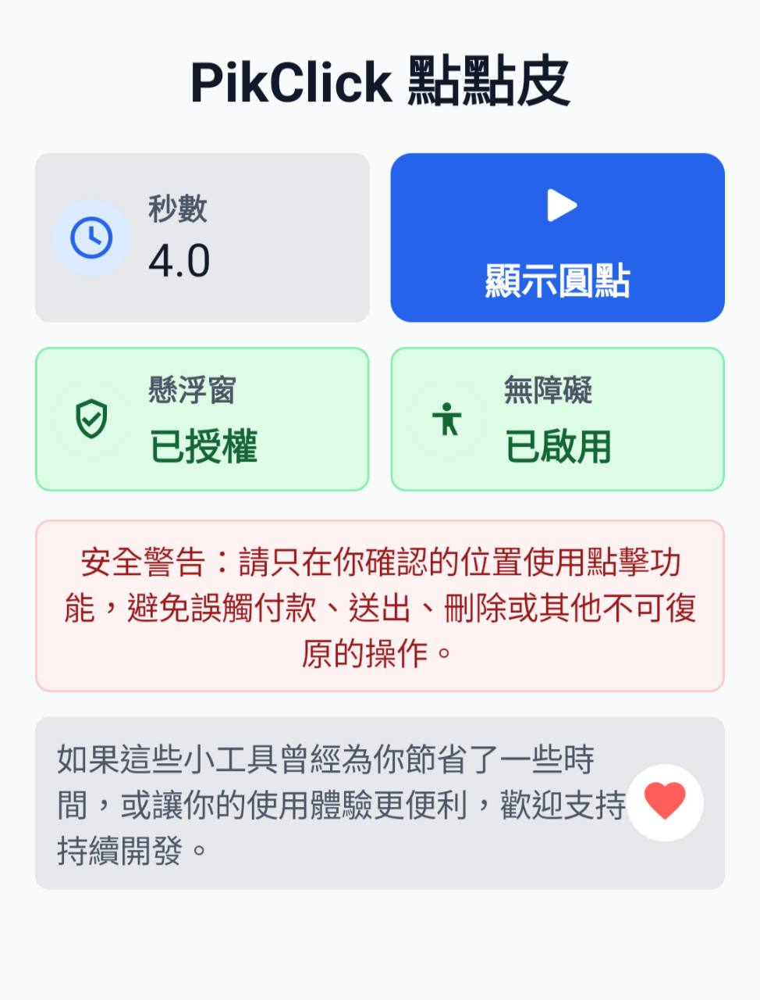
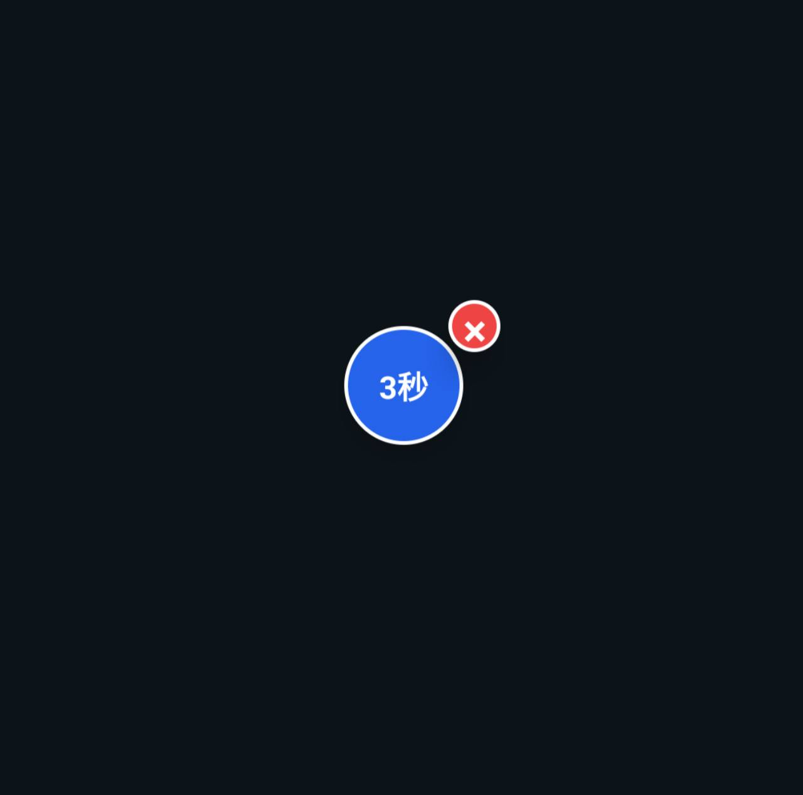

<div align="center">
  

  <p><strong>一個簡單、透明、由你控制的 Android 延遲雙擊工具。<br>A simple, transparent, user-controlled timed double-tap utility for Android.</strong></p>

  <p>
    <a href="https://github.com/YihongTools/PikClick/releases/latest"></a>
    
    <a href="https://github.com/YihongTools/PikClick/actions"></a>
    
  </p>

  <p><a href="#繁體中文">繁體中文</a> · <a href="#english">English</a> · <a href="https://github.com/YihongTools/PikClick/releases">Releases</a> · <a href="docs/PRIVACY_AND_RELEASE.md">Privacy</a></p>
</div>

---

## 繁體中文

### PikClick 是什麼？

PikClick（點點皮）讓你把懸浮圓點拖到指定位置，點一下後立即執行第一次點擊，等待 3–10 秒，再於第二次點擊當下的圓點中心執行。倒數期間可移動圓點或旋轉螢幕以選擇新位置。每一組操作都必須由使用者主動觸發；App 不會讀取畫面文字，也不需要網路權限。

> [!WARNING]
> 請勿將圓點放在付款、購買、刪除、送出或授權等不可復原的按鈕上。點擊結果由使用者自行確認與承擔。

### 功能特色

- **精準定位**：自由拖曳懸浮圓點，位置會保存在裝置本機。
- **可調延遲**：支援 3.0–10.0 秒，預設 3.5 秒。
- **清楚狀態**：圓點直接顯示倒數、完成、失敗與取消狀態。
- **可隨時取消**：倒數中再次點擊圓點即可取消，舊 callback 不會干擾新流程。
- **每次採用當下位置**：第二次點擊會重新讀取圓點中心；撤銷權限或服務終止會取消序列。
- **隱私優先**：無網路權限、無廣告 SDK、無分析 SDK；設定只存在 App 私有空間。
- **依系統語系顯示**：內建繁體中文與英文介面。
- **最低 Android 8.0**：支援 API 26 以上裝置。

### 使用畫面

| 主畫面 | 懸浮圓點與倒數 |
|:---:|:---:|
|  |  |
| 權限狀態、延遲秒數與「顯示圓點」入口 | 懸浮圓點顯示剩餘倒數，可使用紅色按鈕關閉 |

### 安裝方式

1. 前往 [GitHub Releases](https://github.com/YihongTools/PikClick/releases/tag/v2.1.0)。
2. 下載 `PikClick-v2.1.0-release.apk` 與同名 `.sha256`。
3. 驗證 SHA-256 後，在 Android 裝置允許此來源安裝 APK。
4. 開啟 PikClick，依序允許「顯示在其他應用程式上層」與啟用 PikClick 無障礙服務。
5. 設定秒數、顯示圓點、拖到目標位置後點一下開始。

完整步驟與風險說明請見 [INSTALL.md](INSTALL.md)，整合與實機方法見 [docs/ANDROID_TESTING.md](docs/ANDROID_TESTING.md)。

### 從原始碼建置

需求：JDK 17、Android SDK 35。Gradle Wrapper 會固定使用 Gradle 8.7。

```bash
./gradlew testDebugUnitTest assembleDebug
./gradlew connectedDebugAndroidTest  # requires an emulator or device
```

正式 Release 需要自行準備未納入 Git 的 `keystore.properties` 與簽章檔：

```bash
./gradlew clean checksumReleaseApk
```

產物會複製到 `dist/PikClick-v2.1.0-release.apk`，並產生 SHA-256 檔案。

### 開發規劃

- [x] 懸浮圓點拖曳與位置保存
- [x] 可調延遲雙擊、倒數與取消
- [x] 權限狀態引導、安全警告
- [x] Gradle Wrapper、單元測試、CI 與 Release checksum
- [x] 繁體中文／英文介面與無障礙用途顯著揭露
- [x] Dependabot、CodeQL、Release CI 與手動 Emulator Matrix
- [ ] 補齊 Android 8／11／13／15 真機測試矩陣
- [x] 補上可驗證的使用畫面
- [ ] 完成實體裝置的旋轉、撤權、程序終止與品牌省電驗收
- [ ] 建立公開隱私政策頁面與選定正式發布通路

### 參與貢獻

歡迎透過 [Issues](https://github.com/YihongTools/PikClick/issues) 回報可重現問題，或提交 Pull Request。送出前請執行測試並附上裝置型號、Android 版本、重現步驟及預期／實際結果。

---

## English

### What is PikClick?

PikClick is an Android utility that places a draggable floating button over other apps. Tap it once to perform the first tap immediately, wait 3–10 seconds, and perform the second tap at the button center at that moment. You may move the button or rotate the screen during the countdown to choose a new position. Every sequence requires an explicit user action. PikClick does not read on-screen text and does not request network access.

> [!WARNING]
> Never place the button over payment, purchase, delete, submit, authorization, or other irreversible controls. You are responsible for verifying the result of every tap.

### Features

- **Precise placement** — drag the floating button anywhere; its position is stored locally.
- **Adjustable delay** — choose 3.0–10.0 seconds; the default is 3.5 seconds.
- **Visible state** — countdown, completion, cancellation, and failure are shown on the button.
- **Safe cancellation** — tap again during a countdown to cancel; stale callbacks cannot affect a new sequence.
- **Current position per tap** — the second tap re-reads the button center; revoking permission or terminating the service cancels the sequence.
- **Privacy first** — no network permission, ads, or analytics; preferences remain in app-private storage.
- **System-language UI** — includes Traditional Chinese and English resources.
- **Android 8.0+** — supports API level 26 and later.

### Screenshots

| Main screen | Floating button and countdown |
|:---:|:---:|
|  |  |
| Permission status, delay input, and the show-button action | Floating countdown with a red close button |

### Installation

1. Open the [v2.1.0 release](https://github.com/YihongTools/PikClick/releases/tag/v2.1.0).
2. Download `PikClick-v2.1.0-release.apk` and its `.sha256` file.
3. Verify the SHA-256 digest, then allow APK installation from that source.
4. Open PikClick, grant the overlay permission, and enable the PikClick accessibility service.
5. Choose a delay, show the floating button, drag it into position, and tap to begin.

See [INSTALL.md](INSTALL.md) for the complete procedure and safety notes, and [docs/ANDROID_TESTING.md](docs/ANDROID_TESTING.md) for the emulator and physical-device matrix.

### Build from source

Requirements: JDK 17 and Android SDK 35. The wrapper pins Gradle 8.7.

```bash
./gradlew testDebugUnitTest assembleDebug
./gradlew connectedDebugAndroidTest  # requires an emulator or device
./gradlew clean checksumReleaseApk  # requires local release signing files
```

The signed artifact and its checksum are copied to `dist/PikClick-v2.1.0-release.apk`.

### Roadmap

- [x] Draggable floating button with saved position
- [x] Adjustable timed double tap, countdown, and cancellation
- [x] Permission guidance and safety warning
- [x] Gradle Wrapper, unit tests, CI, and release checksum
- [x] Traditional Chinese/English UI and prominent accessibility disclosure
- [x] Dependabot, CodeQL, release CI, and a manual emulator matrix
- [ ] Complete the Android 8/11/13/15 physical-device matrix
- [x] Add verified usage screenshots
- [ ] Complete physical-device rotation, permission-revocation, process-death, and vendor battery-management tests
- [ ] Publish a privacy-policy page and select a formal distribution channel

### Contributing

Reproducible bug reports and pull requests are welcome through [GitHub Issues](https://github.com/YihongTools/PikClick/issues). Include the device model, Android version, reproduction steps, expected behavior, and actual behavior. Run the test suite before opening a pull request.

### License

PikClick is available under the [MIT License](LICENSE).

---

<div align="center">
  <sub>Built with care for deliberate, user-controlled interactions.</sub>
</div>
